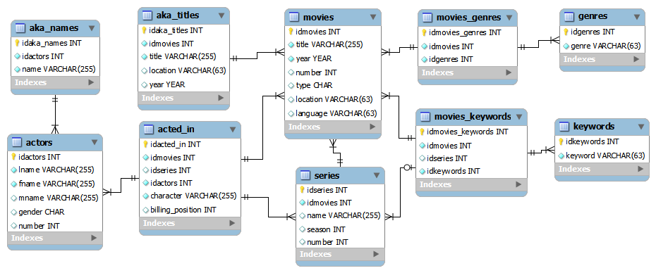

# IMDB DB Converter
The file tosql.py converts (some of) the raw *.list files to a sql database 
define by the schema below. The schemas folder contains the appropriate 
sql commands to construct the database for the supported databases (see
the `DatabaseTypes` class in the tosql.py script)

